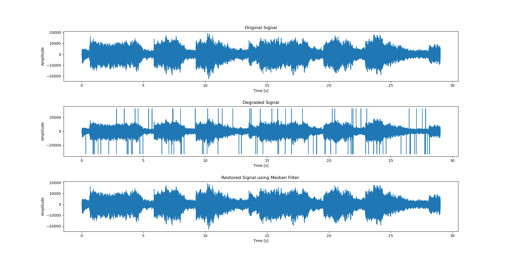
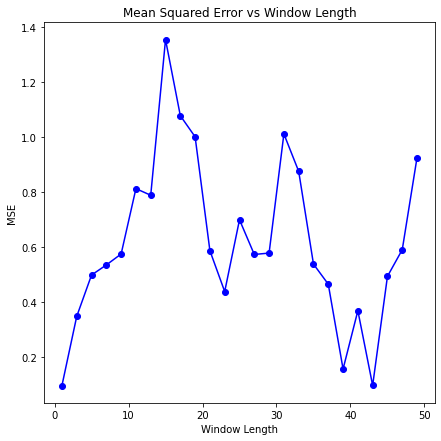
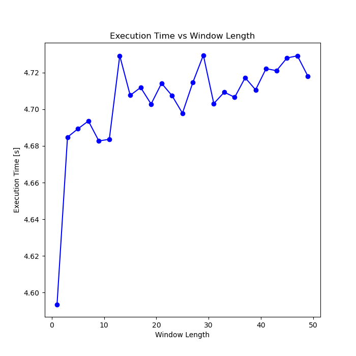
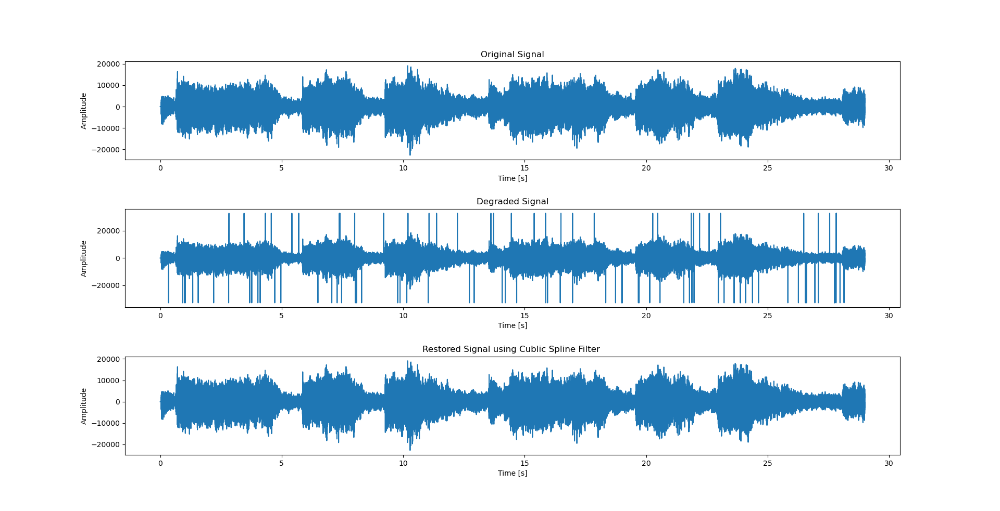

# Audio Restoration using Median Filer and Cubic Spline Filter

## Table of Contents
1. [High-level Description of the project](#my-first-title)
2. [Installation and Execution](#my-second-title)
3. [Methodology and Results](#my-third-title)
4. [Credits](#my-fourth-title)

## High-level Description of the project
This assignment builds on [Assignment I](https://github.com/iamronaldlaban/Audio-Restortation-using-AR-models-in-MATLAB) . We assume that we have successfully detected the clicks and we are applying different interpolation methods to restore the audio, such as
- median filtering
- cubic splines

---

## Installation and Execution
- Before executing the *.py* file the following library dependencies need to be installed. These can be also viewed in **requirements.txt** files.  

``` sh
  - matplotlib==3.4.3
  - numpy==1.20.3
  - playsound==1.2.2
  - scikit_learn==1.1.3
  - scipy==1.7.1
  - tqdm==4.62.3
```
- The following files need to be also loaded in the directory for the smooth execution of the code.

``` sh
  - original.wav
  - degraded.wav
  - degraded_points. mat
```

- Afer installing all required packages you can run the demo file simply by typing:
```sh
python test_median_Filter.py
python test_Cubic_Spline.py
```
---

## Methodology and Results
**Methodology**

**Median Filter**
  1.  Read the original signal and the degraded signal using `wavfile.read`
  2.  To know the position of the clicks, load the **.mat** file using `loadmat`
  3.  As reading a **.mat** file creates a dictioary, we need to extract the keys and using the correct keys extractt the degraded points.
  4.  From degraded points using `np.where` extract the indexes of the clicks.
  5.  Enter the Window Length for the median filter from the user. *Note: The window size must be ODD, for even window length the program will stop execution
  6.  Call the function(*user-defined*) `median_filter` to obtain the restored signal
      1.  Depending on the click position, pass window length number of parameters around the click, inculding the click.
      2.  Depending on the window lenght, *window length - 1 / 2* number of zeros are padded on both sides of the data.
      3.  A window is passed over the data from the starting point and shifted to the right with a increment of one, until the boundary of thr window covers the last data point.
      4. As the window is passing, the data points in the window are sorted in acensending order and the median value is selected from that data set and stored in a new matrix.
      5.  Shift the window by one point and repeat the above step until the boundary includes the last point.
      6. The new matrix is the same size as the window length. Replace the old data point with the content of the new matrix. The content of the new matrix are filtered output wherein the click (*high amplitude postive/negative*) value is repaced by its neighboring value.
      7. Repeat step i. to vi. for all the click values.
      8. A progress bar was added to check the progress of the median filter evaluation. Also the execution time was measured.
  7.  The restored signal is write as `.wav` file using the command `wavfile.write`.
  8.  The mean squared error between original signal and restored signal was evaluated.
  9.  A unittest function was added to check the proper functioning of the user defined median filter with the in-built median filter `scipy.signal.medfilt'.
  10.  The results are plotted as seen in Figure 1.
     
**Cubic Spline Filter**

1.  Step 1. to 4. is similar to median filter.
2.  Call the function `CubicSplineInterpolator` to obtain the restored signal free of clicks.
    1.  Create an array of all the index values depending on the length of the degraded signal.
    2.  Filter the click indexes, and obtain a new filtered index array.
    3.  Using click indexes, filter out the clicks and obtain a new filtered data array.
    4.  The filtered index and filtered data is given as input to in-built function `CubicSpline`. A new function is obtained at the output *cs* .
    5.  Click indexes are passed through *cs* and the new value for these index point is calculated and replaced in the degraded signal. Thus obtaining the restores signal.
    6. A progress bar was added to check the progress of the median filter evaluation. Also the execution time was measured.
3.  The restored signal is write as `.wav` file using the command `wavfile.write`. 
4.  The mean squared error between original signal and restored signal was evaluated.
5.  The results are plotted as seen in Figure 4.


**Results**

1. For the median filter, for window length = 3, and the original, degraded and restored signals were plotted. It was observed, that median filter was able to remove most of the clicks from the degraded signals.   


For the median filter, mean square error was plotted from window length from 1 to 50 (odd values only) as well as execution time for the same. The MSE has an oscillating behaviour as the window length was increased, as seen in figure below. Minimum MSE were observed for window length 3, 39 and 43. 


The execution time showed as linear growth as the window length was increased, as seen in figure below.



2. For the cubic spline filter, most of the clicks were removed as seen in the figure below. The MSE obtained is around 0.372 and the execution time is 11.23 seconds. 



3. Comparing median filter to cubic spline filter, median filter for window length = 3 has **MSE = 0.210** and **execution time = 5.22 seconds**. Whereas cubic spline filter has **MSE = 0.372** and the **execution time = 11.23 seconds**.

After listening to the two restored files, we notice there are some clicks in the `restored_median.wav` were audible as compared to `restored_cubic.wav`. Secondly the output of the cubic spline filter sounds better in comparison to output of median filter.


---
## Credits

This code was developed for purely academic purposes by Ronald Melwin Laban (iamronaldlaban) as part of the module Computation Method. 

Module Supervisor : Dr. Angeliki Katsenou


